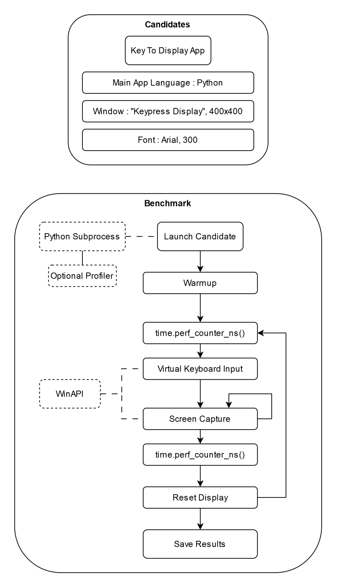

# Key to Display Latency Benchmarking (KDLAB)

Small project trying to evaluate the latency between a key press and its display of multiple implementations / frameworks.

## Description

## Technologies Used

- [pywin32](https://github.com/mhammond/pywin32) for some Windows APIs interactions using Python.

## License

[MIT License](LICENSE)

## Acknowledgement

- Analyze of the typing latency of text/code editors with relevant article (https://github.com/pavelfatin/typometer).